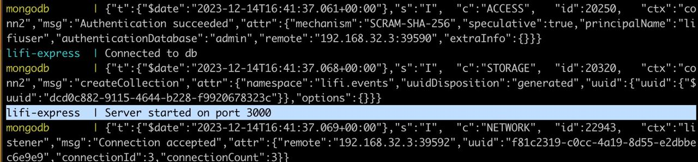
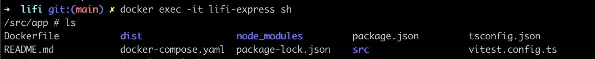
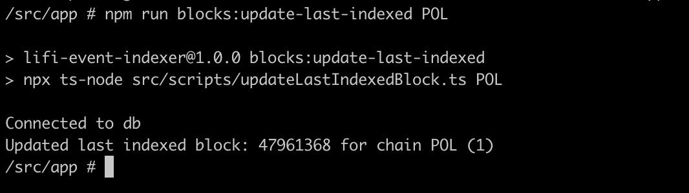
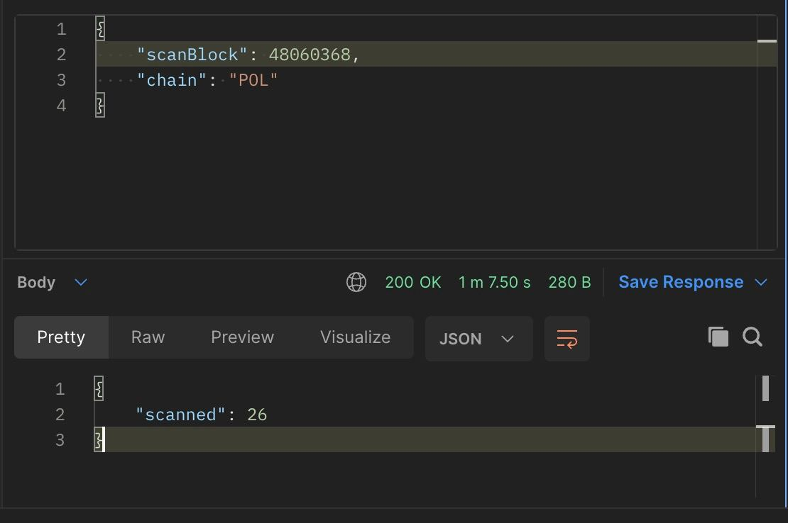
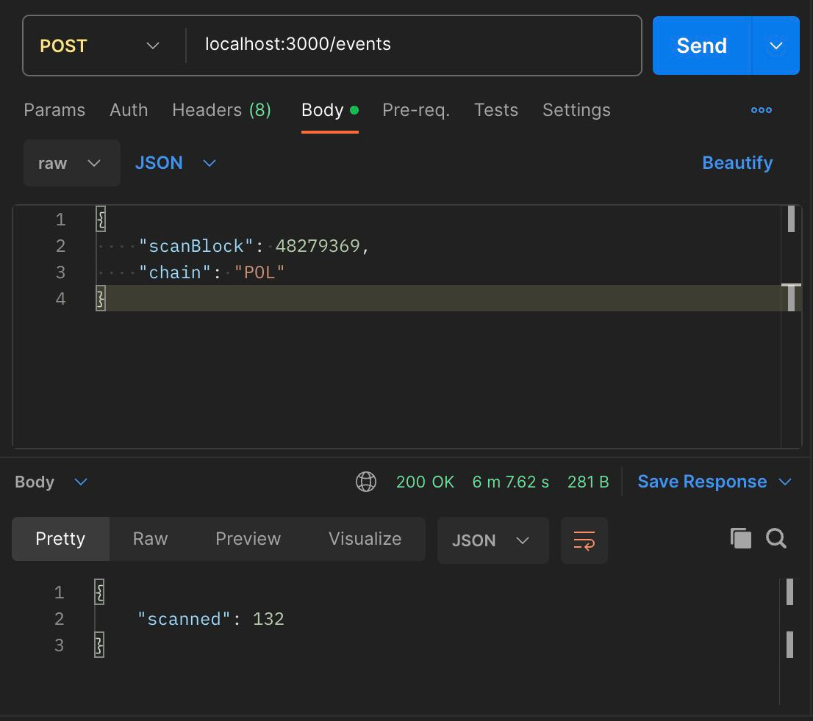
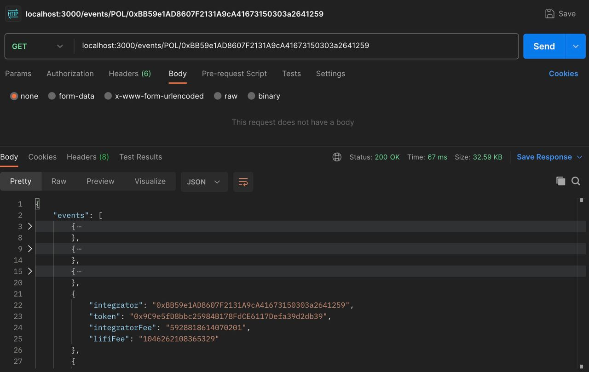

## LiFi Assignment: Working with Events

# Background

We have a Smart Contract which is responsible for collecting fees for our transactions when certain conditions are met. This contract is called the `FeeCollector` and is deployed to all EVM chains that we support. [You can see if for example on Polygon](https://polygonscan.com/address/0xbD6C7B0d2f68c2b7805d88388319cfB6EcB50eA9).

Every time a transaction is submitted that includes fee collection, an event is emitted on this contract. You can see those events [here](https://polygonscan.com/address/0xbD6C7B0d2f68c2b7805d88388319cfB6EcB50eA9#events).

<aside>
💡 Transactions are grouped in EVM Chains in so called blocks. Every block has a unique tag. Emitted events on a smart contract can be queried for a range of blocks.

</aside>

We would like to have the functionality to scan those emitted events, store them in our database and request them based on the integrator that the fees were collected for.

# Pre requisites

Before running the application there're a couple of things we need to have pre installed: 

- Docker 
- Node 18 
- Npm 

Also, we need to have a proper `.env` file. Renaming the `.env.sample` to => `.env` is enough.
Please make sure that the `DB_HOST` matches the `mongodb` docker compose service name, otherwise it won't be able to connect to the app.

* For not running on docker, supplying `127.0.0.1` as the host value will do the trick. (needs mongodb installed locally)

# How to run 

With everything from the above installed, make sure to run the following commands in the stated order. This will ensure a proper env setup for development. 
- `docker compose up --build`
Will get in charge of pulling the mongodb img, building the lifi-express service, and running both. 

If everything goes ok, we should see something like this 

After docker compose up --build, some setup is needed. Due to the database being empty, we need to update at least initially one block index.
To do this, we need to run a prior script to fill the `lastIndexedBlock` value. Otherwise it will fail. 

On another terminal, run: 

- `docker exec -it lifi-express sh`

This will get us inside the lifi-express service docker, from here, we need to run the following script :

- `npm run blocks:update-last-indexed POL`  

* POL is the value of the Polygon chain we're using for the example. 

This will set the default oldest block provided by the assignment as 
the lastIndexed block. 

We're all set now, we can interact with both exposed endpoints and test the app. 

Since the assignment doesn't explicitly mentions what kind of tool to build, I've decided to go with a server and expose the following endpoints:

- POST `/events`
For scrapping new events. Accepts optional `scanBlock` as parameter to set an upper block range scan. Otherwise it will fetch the last block from chain. 

Due to time constrains I couldn't complete a proper controller test suite but I've managed to test some block ranges (10, 10k, 100k blocks to scan):

10k blocks: 

<!--  -->

100k blocks:

- GET `events/:chain/:integratorAddress`

For getting events by chain, from any integrator address. 

# Custom Scripts 

Along the project I've had the necessity of running this custom tooling to facilitate some tasks. 

-`npm run blocks:update-last-indexed`

Manually sets the last block indexed on the database.

-`npm run blocks:listen-new-blocks`

Manually listens to new blocks given the block range. This could suit as a proper cli if refactored and expanded. Or more meant for a manual tool rather than the server functionality for indexing new blocks.

-`generateHumanReadableABI.ts`

Outputs the human readable abi from a .json abi. Doing File I/O everytime for loading the abi and parsing it wasn't the best practice, and since the contract was _small_ I've decided to keep it as a string constant. 

# Considerations 

There were many considerable challenges along the road which I've found to be quite fun!, some of them: 

- Exceed block range request - strategies to fetch big amount of block range:

 * chunks request for not exceeding maximum block range
 * multiple rpc url providers switching
 * doing a combination of above for getting a more efficient wider block range scrapping

On the other hand, I wasn't the best at time management for tasks and some things were beyond my scope, which led to some decisions in not implementing some things that could be totally improved. Some of them:

- Doing a stronger and more robust testing on the controller and service side.

- Some minor refactors, like the errors, onto a module for unified errors messages.

- Implement logging for better error tracing.

- Instead of having to run a script to fill an initial database value (not the best solution imho), there're better alternatives like running a seed after database initialization. But I sticked to this script from the very beggining for testing purposes and since I had to cut some corners by the very end, I've decided to stick to this method.

Overall, I feel it was a really interesting challenge to implement.
